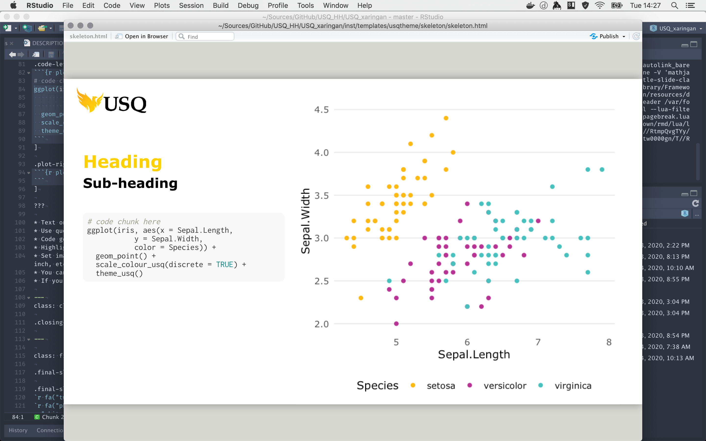

# usq_xaringan

A [***`xaringan`***](https://rmarkdown.rstudio.com/) theme that mimics the USQ corporate PowerPoint template.
The theme provides USQ typography and colours for your presentation in both slides and plots/graphs by default if using [***`ggplot2`***](https://ggplot2.tidyverse.org/) through the use of [***`theme.usq`***](https://adamhsparks.github.io/theme.usq/).

## Install

The template requires the [***`xaringan`***](https://github.com/yihui/xaringan) package by [Yihui Xie](https://yihui.name/), which provides an implementation of [remark.js](https://github.com/gnab/remark) through R Markdown.
It will be installed when you download ***`usq_xaringan`***.

```{r}
if (!require("remotes")) {
  install.packages("remotes", repos = "http://cran.rstudio.com/")
  library("remotes")
}

install_github("adamhsparks/usq_xaringan")
```

## Begin a slideshow

Use the ***`usq_xaringan`*** template in RStudio, go to `File` > `New File` > `R Markdown...` > `From Template` > `Slide template for University of Southern Queensland`

You can also use the `draft()` function from the [***`rmarkdown`***](https://rmarkdown.rstudio.com/) package:

```{r}
rmarkdown::draft(
  file = "your_presentation.Rmd",
  template = "usq_xaringan",
  package = "usq_xaringan"
)
```

## Example screenshots

### Title slide


### Testimonial slide


### Code and graph layout



### Final slide


## Other features
[Fontawesome icons](https://fontawesome.com/) are supported through the [***`fontawesome`***](https://github.com/rstudio/fontawesome) library.
The icons on the final slide above are generated using this.
